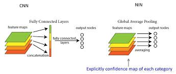
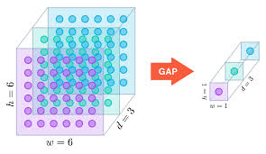

## GAP(GlobalAveragePooling)
this note is about GAP(GlobalAveragePooling), GAP is firsted proposed by the paper——Network in Network.

### why we use GAP
In the last few years, experts have turned to GAP layers to minimize overfitting by reducing the total number of parameters in the model.

For a long time, fully connected network has always been the standard structure of CNN classification network, followed by an activation function to classify. The function of the fully connected network is to stretch the feature map of the last layer of convolution into a vector, multiply the vector,and finally reduces its dimensions, and then input it into the softmax layer to get the score for each category. The fully connected layer is so important that too many parameters of the fully connected layer are able to cause overfitting. So we must find a way to solve the overfitting, such as dropout.

### What is GAP
Similar to the average pooling,  the difference bwtween them is the size of sliding window. Literally, GAP averages the elements of the entire feature map, but the average pooling only averages a sub-area of the feature map.

### How does GAP work
For a classfication problem, supposing we have 1000 classes, so the last layer of convolution should output the feature map with only 1000 channels. Then we app GAP to this feature map, getting a vector with a length of 1000. That means we remove the fully connected layer with GAP, to avoid overfitting.

